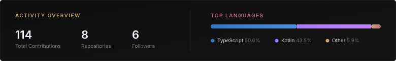
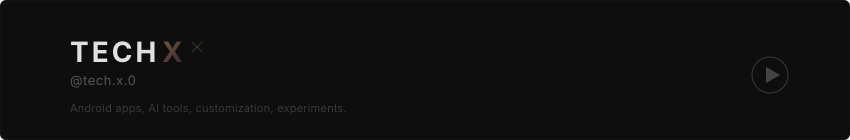

<!-- ╔══════════════════════════════════════════════════╗
     ║              SWASTIK — GitHub Profile             ║
     ║           BSc CS (Sem 6) • Full-Stack Dev          ║
     ╚══════════════════════════════════════════════════╝ -->

  

<!-- ── ABOUT ───────────────────────────────────────── -->

<h4 align="center">about</h4>

  <b>BSc Computer Science (Semester 6)</b> 
  Building modern applications across Android and Web platforms. 
  Passionate about clean architecture, user experience, and solving real-world problems.

  <b> Seeking Internship Opportunities in Android/Full-Stack Development</b>

   <a href="mailto:techx0.official@gmail.com">Email</a> • 
   <a href="https://github.com/swastik-chavan">GitHub</a> • 
   <a href="https://www.youtube.com/@tech.x.0">YouTube</a>

<!-- ── FEATURED PROJECTS ────────────────────────────── -->

<h4 align="center">featured projects</h4>

<table align="center">
  <thead>
    <tr>
      <th align="left" width="200">Project</th>
      <th align="left" width="340">Description</th>
      <th align="center" width="100">Status</th>
    </tr>
  </thead>
  <tbody>
    <tr>
      <td><b><a href="https://github.com/swastik-chavan/audio-booster">Audio Booster</a></b></td>
      <td>Modern Android audio enhancement app with Jetpack Compose & Material 3</td>
      <td align="center"><code>⭐ 4 stars</code></td>
    </tr>
    <tr>
      <td><b><a href="https://github.com/swastik-chavan/skyflow-weather">SkyFlow Weather</a></b></td>
      <td>Full-featured weather app with MVVM, Room, Retrofit & offline support</td>
      <td align="center"><code>⭐ 2 stars</code></td>
    </tr>
    <tr>
      <td><b><a href="https://github.com/swastik-chavan/paprivo-website">Paprivo Website</a></b></td>
      <td>Privacy-focused PDF toolkit landing page with TypeScript & Material UI</td>
      <td align="center"><code>⭐ 2 stars</code></td>
    </tr>
    <tr>
      <td><b><a href="https://github.com/swastik-chavan/taskly-x">Taskly</a></b></td>
      <td>Productivity tracking web app with local storage & analytics</td>
      <td align="center"><code>⭐ 2 stars</code></td>
    </tr>
  </tbody>
</table>

<!-- ── SKILLS ──────────────────────────────────────── -->

<h4 align="center">technical skills</h4>

LANGUAGES

  &nbsp;&nbsp;&nbsp;
  &nbsp;&nbsp;&nbsp;
  &nbsp;&nbsp;&nbsp;
  &nbsp;&nbsp;&nbsp;
  

ANDROID DEVELOPMENT

  &nbsp;&nbsp;&nbsp;
  &nbsp;&nbsp;&nbsp;
  &nbsp;&nbsp;&nbsp;
  

WEB DEVELOPMENT

  &nbsp;&nbsp;&nbsp;
  &nbsp;&nbsp;&nbsp;
  &nbsp;&nbsp;&nbsp;
  &nbsp;&nbsp;&nbsp;
  

BACKEND & DATABASES

  &nbsp;&nbsp;&nbsp;
  &nbsp;&nbsp;&nbsp;
  

TOOLS & PLATFORMS

  &nbsp;&nbsp;&nbsp;
  &nbsp;&nbsp;&nbsp;
  &nbsp;&nbsp;&nbsp;
  

<!-- ── EXPERTISE ───────────────────────────────────── -->

<h4 align="center">core competencies</h4>

  <code>Android Development</code> • 
  <code>Jetpack Compose</code> • 
  <code>Full-Stack Web</code> • 
  <code>REST APIs</code> • 
  <code>MVVM Architecture</code> • 
  <code>Clean Code</code> • 
  <code>UI/UX</code> • 
  <code>Responsive Design</code>

<!-- ── GITHUB STATS ────────���────────────────────────── -->

<h4 align="center">github activity</h4>

  

  

<!-- ── INTERNSHIP FOCUS ────────────────────────────── -->

<h4 align="center">internship profile</h4>

  <b>Education:</b> Bachelor of Science in Computer Science (Semester 6) 
  <b>Focus Areas:</b> Android Development, Full-Stack Web Development 
  <b>Best Work:</b> <a href="https://github.com/swastik-chavan/audio-booster">Audio Booster</a> & <a href="https://github.com/swastik-chavan/skyflow-weather">SkyFlow Weather</a> 
  <b>Experience Level:</b> Intermediate • Hands-on with Modern Architecture Patterns

   MVVM &nbsp;&nbsp;
   Clean Architecture &nbsp;&nbsp;
   API Integration &nbsp;&nbsp;
   Database Design 
   Responsive UI &nbsp;&nbsp;
   Performance Optimization &nbsp;&nbsp;
   Git Workflows

<!-- ── YOUTUBE CHANNEL ─────────────────────────────── -->

<h4 align="center">tech content creator</h4>

  

  Creating educational content on Android development, web technologies, and modern programming practices.

<!-- ── CONTACT ─────────────────────────────────────── -->

<h4 align="center">get in touch</h4>

   <a href="mailto:techx0.official@gmail.com">techx0.official@gmail.com</a> 
   <a href="https://github.com/swastik-chavan">GitHub</a> • 
   <a href="https://www.youtube.com/@tech.x.0">YouTube</a>

<!-- ── FOOTER ──────────────────────────────────────── -->

  Building modern, scalable, and user-centric applications. 
  Open to internship opportunities and exciting projects!

