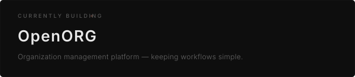

<!-- ╔══════════════════════════════════════════════════╗
     ║              SWASTIK — GitHub Profile             ║
     ║                                                    ║
     ║  To switch to the alternative hero, comment out    ║
     ║  hero.svg below and uncomment hero-alt.svg         ║
     ╚══════════════════════════════════════════════════╝ -->

<!-- ── HERO ────────────────────────────────────────── -->

  

<!-- Alternative hero (uncomment to use):

  

-->

<!-- ── ABOUT ───────────────────────────────────────── -->

<h4 align="center">about</h4>

I build things because I want to understand how they work. 
I experiment across Android, web, tools, AI and whatever else catches my attention.

<b>Currently Learning: Everything</b>

<!-- ── CURRENTLY BUILDING ──────────────────────────── -->

<h4 align="center">currently building</h4>

  

<!-- ── SELECTED WORK ───────────────────────────────── -->

<h4 align="center">selected work</h4>

<table align="center">
  <thead>
    <tr>
      <th align="left" width="200">Project</th>
      <th align="left" width="340">Description</th>
      <th align="center" width="100">Status</th>
    </tr>
  </thead>
  <tbody>
    <tr>
      <td><b><a href="https://github.com/swastik-chavan">OpenORG</a></b></td>
      <td>Organization management platform</td>
      <td align="center"><code>building</code></td>
    </tr>
    <tr>
      <td><b><a href="https://github.com/swastik-chavan/paprivo-website">Paprivo Website</a></b></td>
      <td>Web experience for Paprivo</td>
      <td align="center"><code>completed</code></td>
    </tr>
    <tr>
      <td><b><a href="https://github.com/swastik-chavan/audio-booster">Audio Booster</a></b></td>
      <td>Android loudness enhancement app</td>
      <td align="center"><code>completed</code></td>
    </tr>
  </tbody>
</table>

<!-- ── TECH STACK ───────────────────────────────────── -->

<h4 align="center">tech stack</h4>

LANGUAGES

  &nbsp;&nbsp;&nbsp;
  &nbsp;&nbsp;&nbsp;
  &nbsp;&nbsp;&nbsp;
  &nbsp;&nbsp;&nbsp;
  

ANDROID

  &nbsp;&nbsp;&nbsp;
  

WEB

  &nbsp;&nbsp;&nbsp;
  &nbsp;&nbsp;&nbsp;
  &nbsp;&nbsp;&nbsp;
  &nbsp;&nbsp;&nbsp;
  

BACKEND / SERVICES

  &nbsp;&nbsp;&nbsp;
  

TOOLS

  &nbsp;&nbsp;&nbsp;
  &nbsp;&nbsp;&nbsp;
  &nbsp;&nbsp;&nbsp;
  

<!-- ── GITHUB ──────────────────────────────────────── -->

<h4 align="center">github</h4>

  

  

<!-- ── TECH X ──────────────────────────────────────── -->

<h4 align="center">TECH X</h4>

  

<!-- ── CONTACT ─────────────────────────────────────── -->

<h4 align="center">contact</h4>

  <a href="mailto:techx0.official@gmail.com">techx0.official@gmail.com</a>

<!-- ── FOOTER ──────────────────────────────────────── -->

Building things to solve my own problems.

